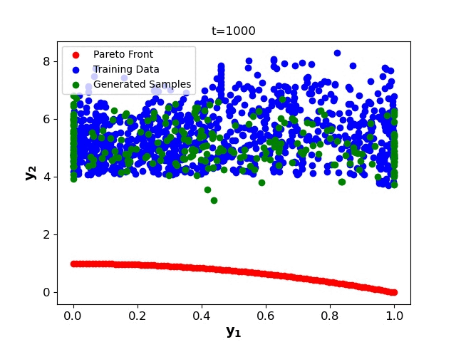

# Preference-Guided Diffusion for Multi-Objective Offline Optimization

This repository contains the implementation of our paper **"Preference-Guided Diffusion for Multi-Objective Offline Optimization"**.
**Paper Link:** [arXiv:2503.17299](https://arxiv.org/abs/2503.17299)

## 🎯 Approach

We propose a preference-guided diffusion model that generates Pareto-optimal designs by leveraging a classifier-based guidance mechanism. Our key innovation is a preference model trained to predict the probability that one design dominates another, which directs the diffusion model toward optimal regions of the design space. We also introduce diversity-aware preference guidance that ensures generated solutions are both optimal and well-distributed across the objective space.




## 🚀 Quick Start

### Install
```bash
# Clone and install
git clone https://github.com/yannadani/pgd_moo.git
cd pgd_moo

# Setup conda environment
conda env create -f environment.yml
conda activate offline-moo

# Run installation script
bash install.sh

# Download data from [Google Drive](https://drive.google.com/drive/folders/1SvU-p4Q5KAjPlHrDJ0VGiU2Te_v9g3rT?usp=drive_link)
# Place data in `data/` folder
```

**Note:** For detailed benchmark installation instructions, see the [offline MOO benchmark repository](https://github.com/lamda-bbo/offline-moo).

## 📁 File Structure
```
pgd_moo/
├── configs/                    # Configuration files
│   ├── algorithm/             # Algorithm configs
│   └── task/                  # Task configs
├── off_moo_baselines/         # Implementation of methods
│   ├── diffusion_guidance/    # Our proposed method
│   ├── end2end/              # End-to-end approaches
│   ├── multi_head/           # Multi-head approaches
│   ├── multiple_models/      # Multiple models approaches
│   └── pareto_flow/          # Pareto flow baseline
├── off_moo_bench/            # Benchmark code from Xue et al. (2024)
├── scripts/                  # Experiment scripts
```

### Run
```bash
# Activate environment
conda activate offline-moo

# Run our method
bash scripts/pgd_moo.sh

# Run baselines
bash scripts/multi_head.sh
bash scripts/multiple_models.sh
```


## 🤝 Citation
```bibtex
@article{annadani2025preference,
  title={Preference-Guided Diffusion for Multi-Objective Offline Optimization},
  author={Annadani, Yashas and Belakaria, Syrine and Ermon, Stefano and Bauer, Stefan and Engelhardt, Barbara E},
  journal={arXiv preprint arXiv:2503.17299},
  year={2025}
}
```

## 📞 Contact
For questions, open an issue or contact [yashas.annadani@tum.de], [syrineb@stanford.edu]

---
*Built on the offline MOO benchmark by Xue et al. (2024), We thank the authors for their open-source contributions.*
